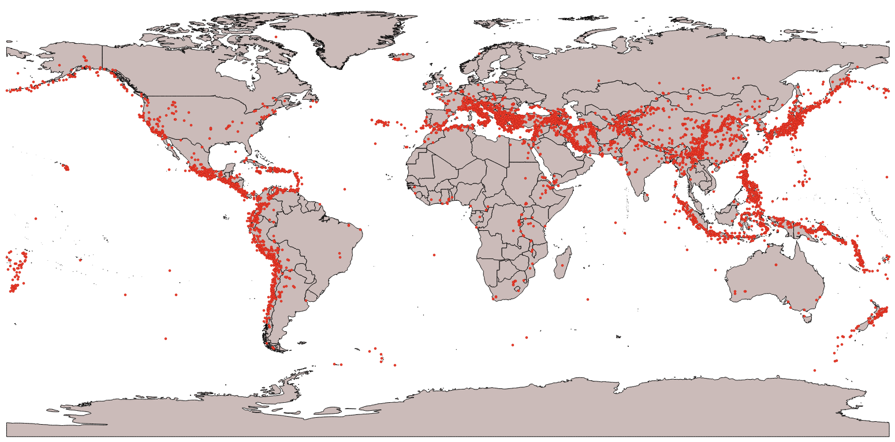

# Significant Earthquakes since 2150 BC

This dataset is from NOAA's Significant Earthquake Database, extracted on October 16.

[Here's a link to their page](https://www.ngdc.noaa.gov/nndc/struts/results?bt_0=&st_0=&type_17=EXACT&query_17=None+Selected&op_12=eq&v_12=&type_12=Or&query_14=None+Selected&type_3=Like&query_3=&st_1=&bt_2=&st_2=&bt_1=&bt_4=&st_4=&bt_5=&st_5=&bt_6=&st_6=&bt_7=&st_7=&bt_8=&st_8=&bt_9=&st_9=&bt_10=&st_10=&type_11=Exact&query_11=&type_16=Exact&query_16=&bt_18=&st_18=&ge_19=&le_19=&type_20=Like&query_20=&display_look=1&t=101650&s=1&submit_all=Search+Database)

Here's a preview I made using the data I saved.

My goal here is to scrape data from the page and save it into a more useable CSV format. I also wanted to demonstrate some of the things you can do with Jupyter Notebook and Pandas.

View the [Notebook](https://github.com/benjiao/significant-earthquakes/blob/master/Significant%20Earthquakes.ipynb) for a demo on how I did the scrape/formatting.

Here's a link to the raw CSV data: https://raw.githubusercontent.com/benjiao/significant-earthquakes/master/earthquakes.csv

